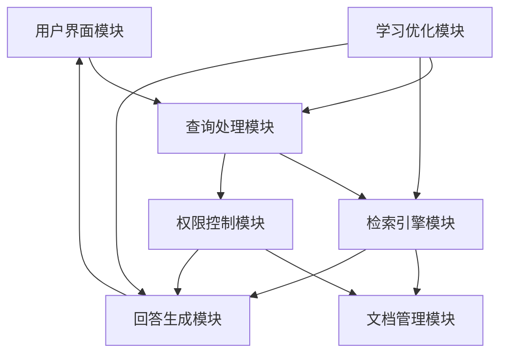

### 当康（dangkang）项目

#### 项目简介

当康（dangkang）是一个强大的智能客户支持系统，旨在通过深度文档理解和检索增强生成（RAG）技术，为用户提供精准、高效的问答服务。我们的系统设计考虑了多种文件格式的解析与管理，并集成了先进的大型语言模型（LLMs），为企业提供全面的智能解决方案。

#### 主要功能

- **用户界面模块**：提供友好、直观的用户界面，供用户输入查询并接收系统回答。
- **查询处理模块**：处理用户输入的查询，进行初步分析和预处理，确保查询的准确性和相关性。
- **文档管理模块**：管理和存储各种格式的文档，基于软件定义存储技术，支持高效的数据管理。
- **检索引擎模块**：利用最先进的RAG技术，在文档中搜索与查询相关的信息，为用户提供准确的答案。
- **回答生成模块**：根据检索结果生成自然语言回答，确保回答的流畅性和易懂性。
- **学习优化模块**：通过用户反馈和交互数据，不断学习和优化系统性能，提升用户体验。
- **权限控制模块**：确保只有授权用户才能访问特定的敏感信息和文档，保障数据安全。

#### 系统架构



#### 安装与使用

1. **克隆仓库** 📥
    ```bash
    git clone https://github.com/TydsManagement/dangkang.git
    ```

2. **进入项目目录** 📂
    ```bash
    cd dangkang
    ```

3. **构建Docker镜像** 🛠️
    ```bash
    docker-compose up -d
    ```

4. **检查服务器状态** 🔍
    ```bash
    docker logs -f dangkang-server
    ```

4. *arm系列验证** 🔍
    ```bash
    docker build -f Dockerfile_arm -t  ragflowserver:dev
    ```

    4. 离线镜像系列验证** 🔍

  https://yun.139.com/shareweb/#/w/i/005CiMp5ne7iM，提取码:Octm

5. **在浏览器中访问** 🌐
    - 进入浏览器并输入服务器IP地址进行访问。

#### 贡献指南

我们欢迎任何形式的贡献，包括但不限于以下几种：
- 提交问题（Issues）和功能请求（Feature Requests）📋。
- 提交代码（Pull Requests）💻。
- 撰写和改进文档📄。

#### 许可证

本项目采用MIT许可证，详情请参阅 [LICENSE](./LICENSE) 文件。

#### 联系方式

如果您有任何问题或建议，请通过以下联系方式与我们取得联系：
- 电子邮件：support@dangkang.io
- GitHub Issues：[https://github.com/TydsManagement/dangkang/issues](https://github.com/TydsManagement/dangkang/issues)

#### 鸣谢

当康（dangkang）项目借鉴了多个开源项目的优秀理念和技术，我们向这些项目的开发者表示诚挚的感谢。

---

通过以上描述，我们希望向用户展示当康（dangkang）项目的独特优势及其在智能客户支持领域的应用潜力。我们致力于不断优化和完善系统，以满足用户日益增长的需求。
